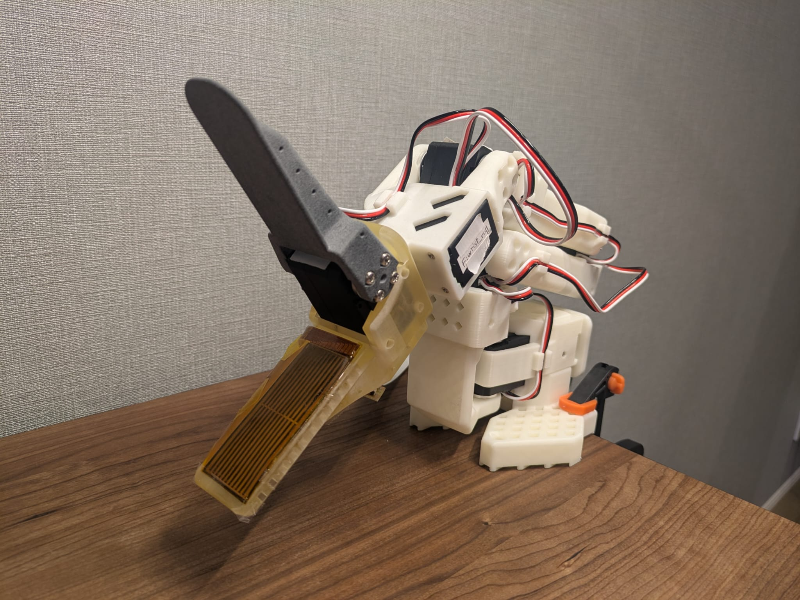

# SO-ARM x Tactile Sensing

SO-ARM visuo-tactile sensing with [FlexiTac](https://flexitac.github.io/).



[Visuo-tactile replay video](artifacts/tactile-smoke-episode-0.mp4)


https://github.com/user-attachments/assets/4a1dc353-89ac-4ac9-8d19-d3abdd2b7df4


This repo records synchronized SO-ARM camera and FlexiTac tactile observations,
shows live tactile heatmaps, and replays saved visual/tactile episodes.

## Setup

Install hardware prerequisites from the linked LeFlexiTac/PyFlexiTac docs, then:

```powershell
uv sync
New-Item -ItemType Directory -Force configs
Copy-Item configs/ports.example.json configs/ports.json
Copy-Item configs/cameras.example.json configs/cameras.json
```

Edit `configs/ports.json` and `configs/cameras.json` for your devices. Most
commands read these files by default, but ports can still be overridden with CLI
flags such as `--leader-port`, `--follower-port`, and `--tactile-port`.

## Runbook

### Find And Flash Tactile Board

```powershell
uv run flexitac-find-port
uv run flexitac-flash --port COM5 --fqbn arduino:avr:nano:cpu=atmega328old
```

Flash only when needed. Replace `COM5` with your detected tactile port.

### Calibrate

```powershell
uv run so-tactile robot calibrate leader --port COM4
uv run so-tactile robot calibrate follower --port COM3
uv run so-tactile tactile calibrate --port COM5
uv run so-tactile tactile status
```

### Check Tactile And Cameras

```powershell
uv run so-tactile tactile check --port COM5
uv run so-tactile heatmap --port COM5
uv run so-tactile cameras check
```

### Teleoperate

```powershell
uv run so-tactile teleop
```

### Record

```powershell
uv run so-tactile record `
  --repo-id local/tactile-smoke `
  --task "Pick up the object" `
  --episodes 1 `
  --episode-time-s 10 `
  --reset-time-s 5
```

Datasets are stored under `outputs/datasets/captures/`.

### Inspect And Replay

```powershell
uv run so-tactile dataset-info --repo-id local/tactile-smoke
uv run so-tactile replay-recorded --repo-id local/tactile-smoke --episode 0
uv run so-tactile replay-live-tactile --repo-id local/tactile-smoke --episode 0
```

`replay-recorded` uses saved camera/tactile data. `replay-live-tactile` drives
the follower while showing the current tactile stream.

## Development

```powershell
uv run pre-commit install
uv run pre-commit run --all-files
```

## Links

- [LeFlexiTac docs](https://tna001-ai.github.io/LeFlexiTac/docs.html)
- [WT-MM/PyFlexiTac](https://github.com/WT-MM/PyFlexiTac)
- [Arduino CLI installation](https://arduino.github.io/arduino-cli/latest/installation/)
